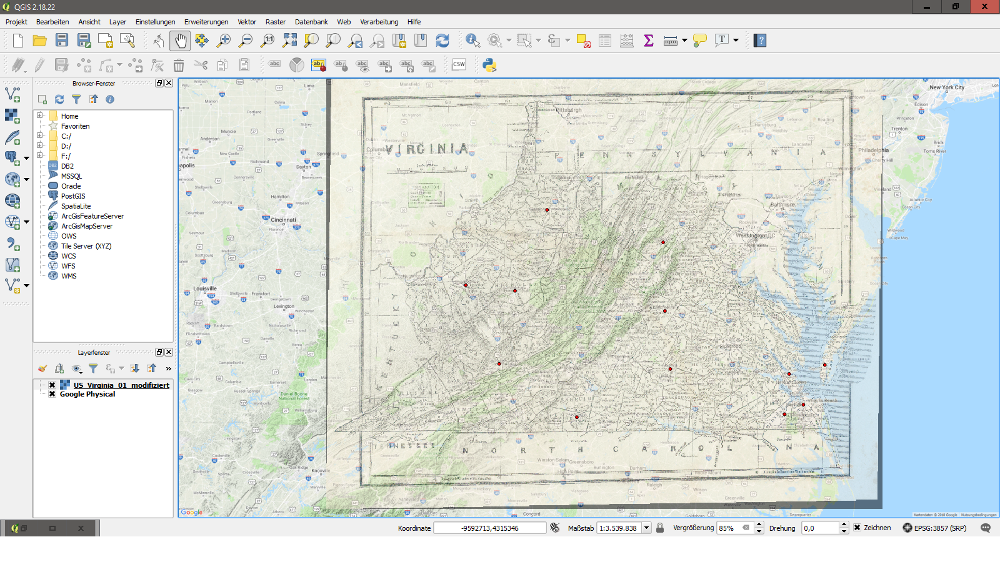

### Task:
We had to chose one out of three maps and georeference it with QGIS. Since I unfortunatly was not able to attend the class, I am not sure if I have done it correctly.
### Solution:
Here is a screenshot of the georeferenced map of Virginia:

