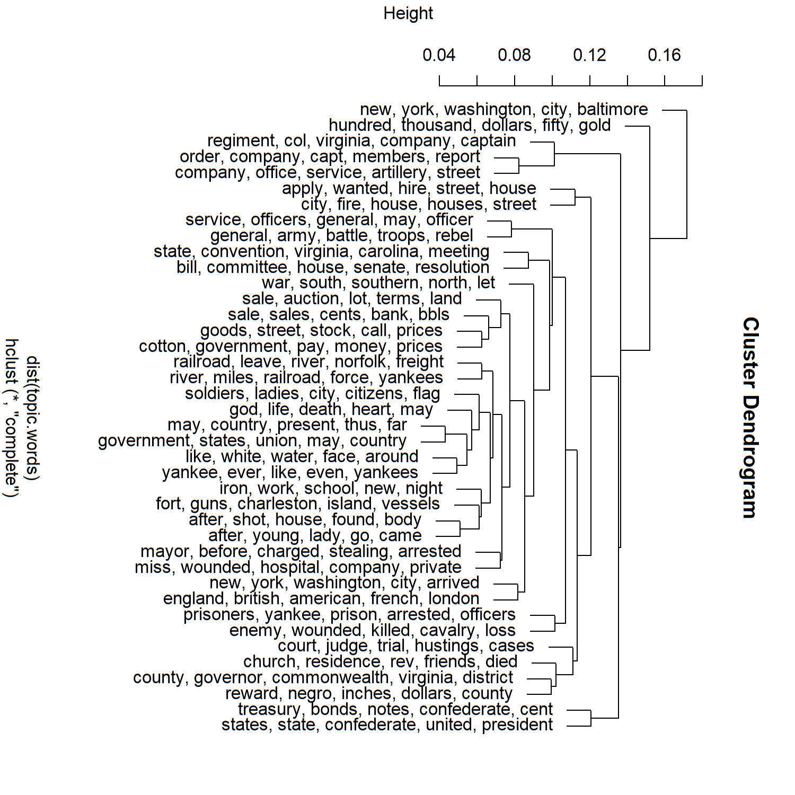
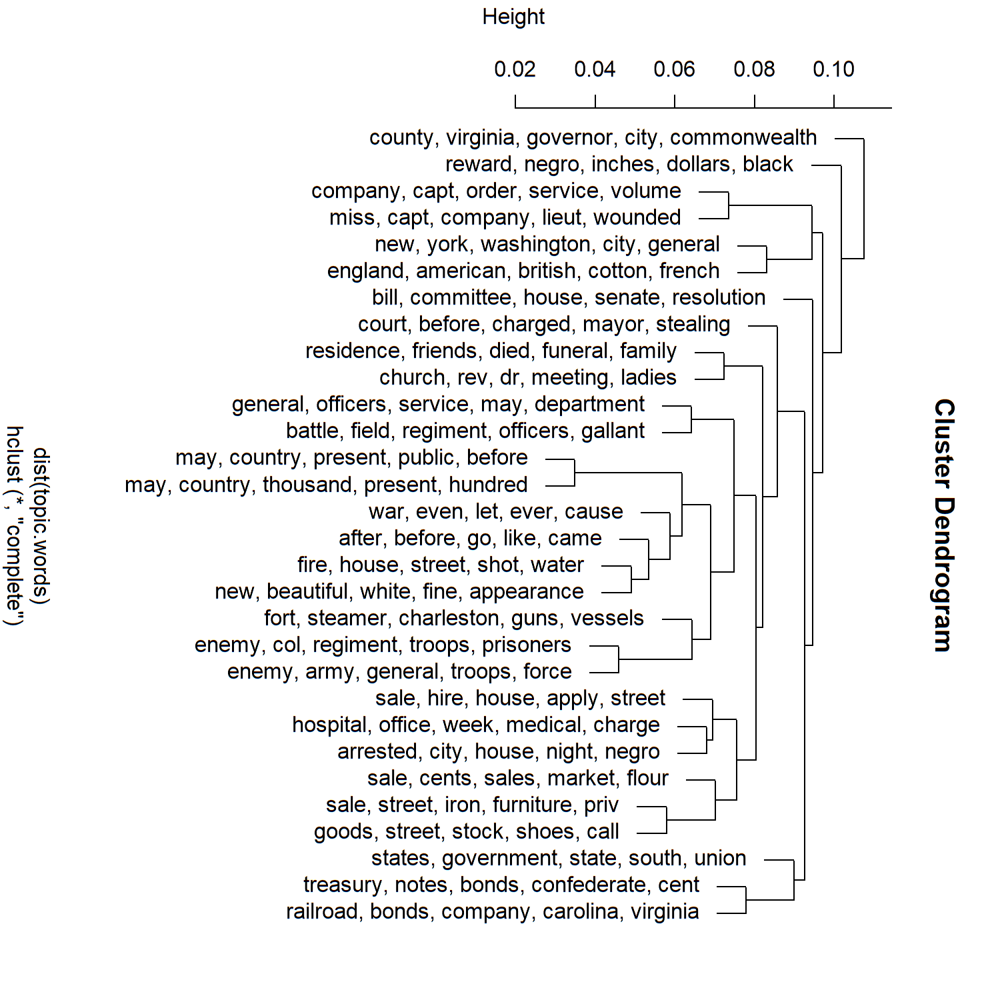

### Task:
We had to topic model our dispatch with a provided R script and compare two different versions. One with using 30 topics and one with
40 topics. All instructions regarding the script and using R were included in the script itself. The only number I changed between both
scripts were on line 76 the number of topics. I am not sure though if there had to be changed anything more.

### Script:
```
# "Mining the Dispatch," seeks to explore and encourage exploration of the dramatic and often
# traumatic changes as well as the sometimes surprising continuities in the social and political
# life of Civil War Richmond. It uses as its evidence nearly the full run of the Richmond Daily
# Dispatch from the eve of Lincoln's election in November 1860 to the evacuation of the city in
# April 1865. It uses as its principle methodology topic modeling, a computational, probabilistic
# technique to uncover categories and discover patterns in and among texts. On this site you'll
# be able to view and generate graphs and charts that reveal some of the changing patterns in the
# topics that dominated the news during the Civil War in the capital of the Confederacy's
# newspaper of record.

# NB: Required files in a folder:
# dispatch_articles_for_tm_tabular.txt
# dispatch_articles_topic_model_advanced.R
# dispatch_issues_for_tm_stopwords_curated_outOf300.csv

# the following lines 
#install.packages("rstudioapi")
library(rstudioapi)
current_path <- getActiveDocumentContext()$path 
setwd(dirname(current_path))
print(getwd())

#############################################################################
################# Load Dispatch Articles (one "article" per row) ############
#############################################################################

library(readr)
dispatch.articles <- read.csv(file="dispatch_articles_for_tm_tabular.txt",
                            header=F, sep="\t", quote="",
                            stringsAsFactors=FALSE)

colnames(dispatch.articles) = c("id", "date", "type", "words", "text")

# save as R object
#saveRDS(dispatch.articles,file="dispatch_articles_for_tm_tabular.Rda")
# dispatch.articles <- readRDS(file="dispatch_articles_for_tm_tabular.Rda")

# write.table(dispatch.articles[1:1000,], file = "dispatch_articles_for_tm_tabular_short.txt",
#             row.names=FALSE, na="", quote=FALSE, col.names=TRUE, sep="\t")

#############################################################################
################# MALLET: following http://www.themacroscope.org/?page_id=822
#############################################################################

#install.packages("rJava")
#install.packages("mallet")

#on Windows, mostly
Sys.setenv(JAVA_HOME='C:/Program Files/Java/jre1.8.0_171') # must be the path to Java on your PC
Sys.getenv("JAVA_HOME") # to check the current one
# Some other settings might be in need of correction, like memory
options(java.parameters = "-Xmx8182m")
# loading rJava after!
# rJava or mallet may not load, most likely reasons:
# - 1) need the explicit path to Java (line 50 above);
# - 2) both R and Java must be of the same type either 32 or 64 bit! (for R: check `Tools` > `Global Options`)
library(rJava)
library(mallet)

test = dispatch.articles
#test = dispatch.articles[1:1000,] # comment this one out for full run

test = data.frame(test$id, test$text, stringsAsFactors = F)
colnames(test) = c("id", "text")
mallet.instances <- mallet.import(test$id,
                                  test$text,
                                  "./dispatch_issues_for_tm_stopwords_curated_outOf300.csv", # file with stopwords
                                  FALSE,
                                  token.regexp = "[\\p{L}']+")

# NB: for saving results, especially if you make multiple runs, it makes 
#     sense to save file results with appropriate suffixes that would allow
#     to differentiate among different versions of results for post-analysis
#     also, it may make sense to have a spot where you define all your parameters

n.topics <- 40
alphaOptimizationMin <- 20
alphaOptimizationMax <- 50
reiterate <- 100 # change to 100 for test run; 500 (of higher) for better results -- takes much longer
maximization <- 10

# in the file.suffix, you want to save all the parameters that you used for generating
# topic models, namely:
# - n.topics
# - alphaOptimization
# - repetitions / train
#  - maximization parameter (not sure what that one does...)

file.prefix = paste0("tm", n.topics, "_A", alphaOptimizationMin, "_", alphaOptimizationMax,
                     "_iter", reiterate, "_Max", maximization, "_")

# paste0(fileName, file.prefix, extension)

# Starting analysis

topic.model <- MalletLDA(n.topics)
topic.model$loadDocuments(mallet.instances)
vocabulary <- topic.model$getVocabulary()
word.freqs <- mallet.word.freqs(topic.model)
#length(vocabulary)
#vocabulary[1:100]
#head(word.freqs)

#############################################################################
# stopwords: run if no stopword list is available ###########################
# stopwords = as.data.frame(word.freqs)
# stopwords = stopwords[with(stopwords, order(-term.freq)), ]
# stopwords = data.frame(stopwords$words)
# write.table(stopwords, file = "dispatch_issues_for_topic_model_stopwords_new.csv", row.names=FALSE, na="", quote=FALSE, col.names=TRUE, sep="\t")
# this is a full list/table, which needs to be trimmed manually #############
#############################################################################

#############################################################################
# The following three lines of code will take a while to run ################
### the higher VAL in topic.model$train(VAL), the longer it takes ###########
### the optimal seems to be 500; leave it overnight :) ######################
#############################################################################

topic.model$setAlphaOptimization(alphaOptimizationMin, alphaOptimizationMax)
topic.model$train(reiterate) #initial: 200; the higher the number the longer it takes to finish
# with 200 iterations, and all issues (~1300), Total time is: 5 minutes 15 seconds
# with 500 iterations, and all articles (~140k): Total time: 11-12 minutes
# (on MacBook Pro, i7, 16Gb RAM)
topic.model$maximize(maximization)

# Continue analysis

doc.topics <- mallet.doc.topics(topic.model, smoothed=T, normalized=T)
topic.words <- mallet.topic.words(topic.model, smoothed=T, normalized=T)

topic.docs <- t(doc.topics)
topic.docs <- topic.docs / rowSums(topic.docs)
write.csv(topic.docs, paste0("./", file.prefix, "topics-docs-articles.csv"))

# Get a vector containing short names for the topics
topics.labels <- rep("", n.topics)
topics.label.length <- 5
for (topic in 1:n.topics) topics.labels[topic] <- paste(mallet.top.words(topic.model, topic.words[topic,], num.top.words=topics.label.length)$words, collapse=", ")
## cluster based on shared words
plot(hclust(dist(topic.words)), labels=topics.labels)

#############################################################################
# this will save an image of the dendrogram #################################
png("dendrogram_of_topics.png", width=1500, height=1500, res=200)
plot(hclust(dist(topic.words)), labels=topics.labels)
dev.off()
#############################################################################

# Get a vector containing longer names for the topics
topics.labels <- rep("", n.topics)
topics.label.length <- 15
for (topic in 1:n.topics) topics.labels[topic] <- paste(mallet.top.words(topic.model, topic.words[topic,], num.top.words=topics.label.length)$words, collapse=", ")

# have a look at keywords for each topic
topics.labels

# write these to a file
write.csv(topics.labels, paste0("./", file.prefix, "topics-labels-articles.csv"))
topics.labels <- read.csv(file=paste0("./", file.prefix, "topics-labels-articles.csv"),
                          header=TRUE, sep=",", quote='"', stringsAsFactors=FALSE)

# create data.frame with columns as documents and rows as topics
topic_docs <- data.frame(topic.docs)
names(topic_docs) <- test$id

# Further analysis
topics.docs.dates = as.data.frame(t(topic_docs))

# converting from factor to numeric
indx <- sapply(topics.docs.dates, is.factor)
topics.docs.dates[indx] <- lapply(topics.docs.dates[indx], function(x) as.numeric(as.character(x)))

topics.docs.dates = cbind(rownames(topics.docs.dates), topics.docs.dates)
# ids are in topics.docs.dates[,1]
# topics are in topics.docs.dates$V+number
rownames(topics.docs.dates) <- NULL


# JOIN TM TABLE WITH INITIAL DATA!
topics.texts.stats = topics.docs.dates
names(topics.texts.stats)[1] = "id"
# fixing some ID corruption (1864-02-10_article_96 becomes X1864.02.10_article_96)
topics.texts.stats$id = as.character(topics.texts.stats$id)
topics.texts.stats$id = sub("^X", "", topics.texts.stats$id)
topics.texts.stats$id = sub("\\.", "-", topics.texts.stats$id)
topics.texts.stats$id = sub("\\.", "-", topics.texts.stats$id)
topics.texts.stats.complete = merge(topics.texts.stats, dispatch.articles, by="id")

# reading top samples of topics
# - rearrange the table for V40
topics.texts.stats.complete = topics.texts.stats.complete[order(-topics.texts.stats.complete$V40),]
# - print out top 5 samples for V40
topics.texts.stats.complete$text[1:5]

# saving
write.table(topics.texts.stats.complete, file = paste0("./", file.prefix, "topics_docs_dates.txt"),
            row.names=FALSE, na="", quote=FALSE, col.names=TRUE, sep="\t")

# if you have already run the TM process, you can load the results with the following line:
topics.texts.stats.complete <- read.csv(file=paste0("./", file.prefix, "topics_docs_dates.txt"),
                            header=TRUE, sep="\t", quote="",
                            stringsAsFactors=FALSE)
# save as R object
#saveRDS(topics.texts.stats.complete,file=paste0("./", file.prefix, "topics.texts.stats.complete.Rda"))
# read back R object
#topics.texts.stats.complete <- readRDS(file=paste0("./", file.prefix, "topics.texts.stats.complete.Rda"))

####################################################################################################
# Plotting topics over time ########################################################################
# Visualization cookbook: http://r-statistics.co/Top50-Ggplot2-Visualizations-MasterList-R-Code.html
####################################################################################################

library(plyr)
library(ggplot2)

# to graph topics over time the main table must be modified:
# - topic values must be summed up for each day
# -- remove unnecessary columns
topics.texts.stats.cumulative = subset(topics.texts.stats.complete, select = -c(id, type, words, text))
# - focus on the period of the Civil War
topics.texts.stats.cumulative$date = as.Date(topics.texts.stats.cumulative$date)
# American Civil War: Apr 12, 1861 - May 13, 1865
topics.texts.stats.cumulative = topics.texts.stats.cumulative[
  which(topics.texts.stats.cumulative$date >= as.Date("1860-11-01") &
          topics.texts.stats.cumulative$date <= as.Date("1865-04-30")), ]
# calculating total sum of topics per each article
topics.texts.stats.cumulative$total = rowSums(topics.texts.stats.cumulative[1:n.topics])

# Try numbers from 1 to 40 (or higher, if you changed the number of topics)

topic.var = 9
plotting.data = topics.texts.stats.cumulative
plotting.data.var = count(plotting.data, vars=c("date"), wt_var = sprintf("V%d", topic.var))
names(plotting.data.var) = c("date", "var")
plotting.data.tot = count(plotting.data, vars=c("date"), wt_var = "total")
names(plotting.data.tot) = c("date", "tot")
plotting.data.fin = merge(plotting.data.var, plotting.data.tot, by="date")

ggplot(plotting.data.fin, aes(x=date, y=var/tot*100)) +
  geom_line(aes(y=var/tot*100), col="gray") +
  geom_smooth(method="loess", span = 0.1, col="blue") +
  labs(title=paste0("Topic ",topic.var," Over Time"),
       subtitle=paste("Topic Words:", topics.labels[topic.var,][2]),
       caption="Source: Richmond Dispatch (Americal Civil War Period)",
       y="Frequencies %")

# save the graph
graph.name = paste0(file.prefix, "Topic_", topic.var, ".png")
ggsave(graph.name, width = 10, height = 5, dpi = 300)

# Now print out a few top samples of a topic
topics.texts.stats.complete = topics.texts.stats.complete[order(-topics.texts.stats.complete[,topic.var+1]),]
topics.texts.stats.complete$text[1:5]

### GENERATE ALL GRAPHS IN A LOOP ###

for(i in seq(1, 40, 1)){
  topic.var = i
  plotting.data = topics.texts.stats.cumulative
  plotting.data.var = count(plotting.data, vars=c("date"), wt_var = sprintf("V%d", topic.var))
  names(plotting.data.var) = c("date", "var")
  plotting.data.tot = count(plotting.data, vars=c("date"), wt_var = "total")
  names(plotting.data.tot) = c("date", "tot")
  plotting.data.fin = merge(plotting.data.var, plotting.data.tot, by="date")
  
  ggplot(plotting.data.fin, aes(x=date, y=var/tot*100)) +
    geom_line(aes(y=var/tot*100), col="gray") +
    geom_smooth(method="loess", span = 0.1, col="blue") +
    labs(title=paste0("Topic ",topic.var," Over Time"),
         subtitle=paste("Topic Words:", topics.labels[topic.var,][2]),
         caption="Source: Richmond Dispatch (Americal Civil War Period)",
         y="Frequencies %")
  
  # save the graph
  graph.name = paste0(file.prefix, "Topic_", topic.var, ".png")
  ggsave(graph.name, width = 10, height = 5, dpi = 300) 
}
```

### Results:
#### 40 topics:


#### 30 topics:


I am not sure if this is all correctly done, but the 40 topic dendrogram seems to be a lot more precise and provide more information than
the 30 topic one, which seems bit random in terms of topics. 
